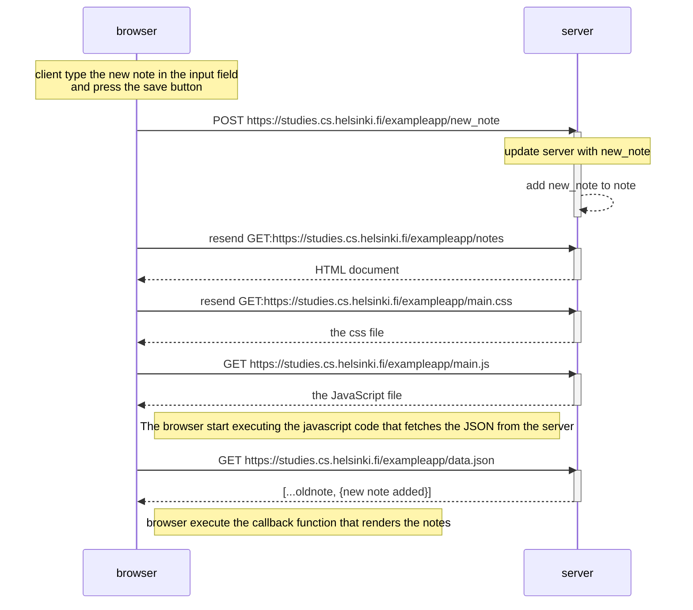
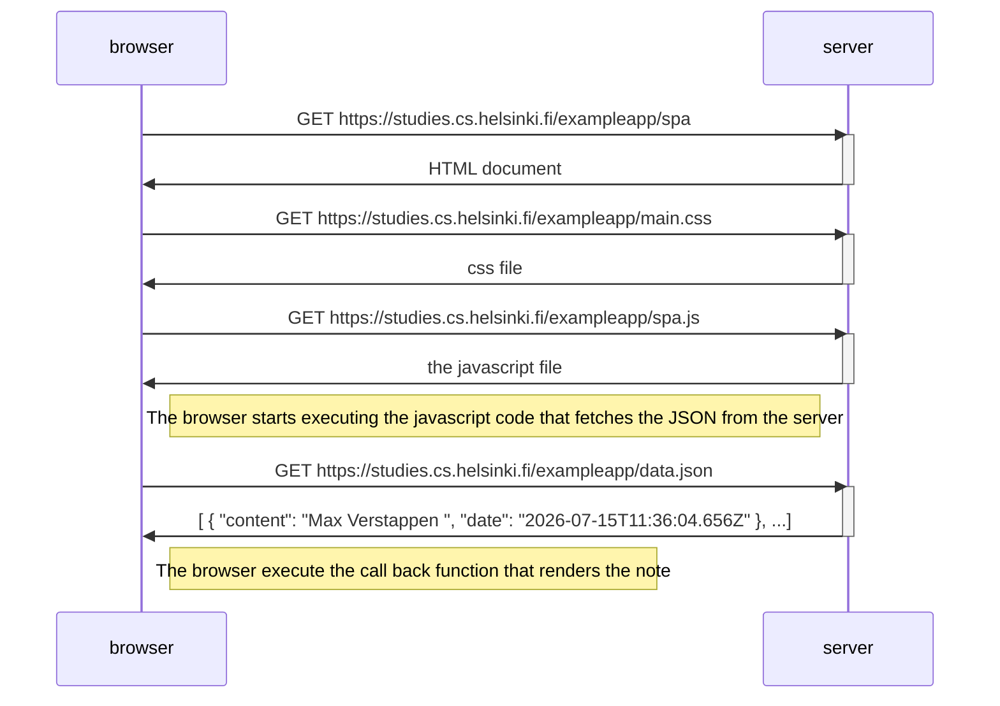
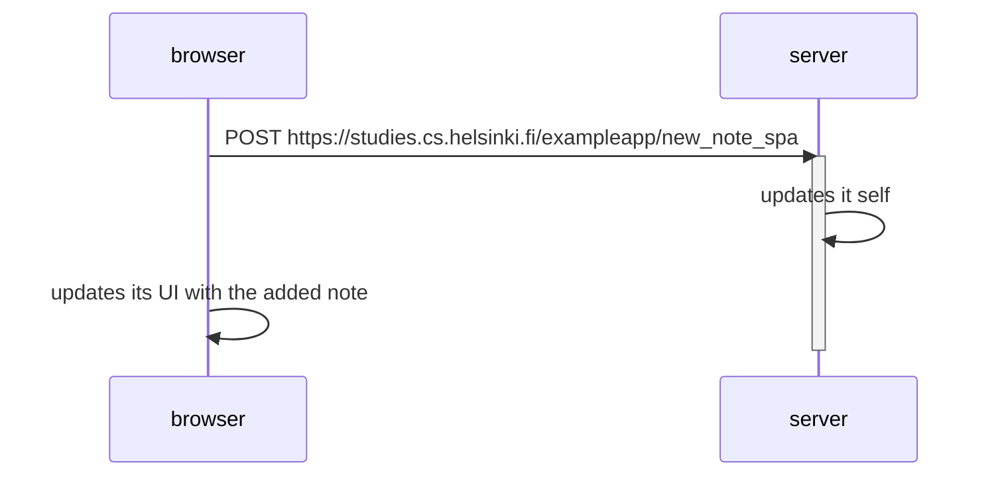

# Full Stack Open: Part 0 Excercise

## Excercise 0.4: New note diagram

```mermaid
sequenceDiagram
    participant browser
    participant server

    Note over browser: client type the new note in the input field<br/>and press the save button

    browser->>server: POST https://studies.cs.helsinki.fi/exampleapp/new_note
    activate server
    Note over server: update server with new_note
    server-->>server: add new_note to note
    deactivate server

    browser->>server: resend GET:https://studies.cs.helsinki.fi/exampleapp/notes
    activate server
    server-->>browser: HTML document
    deactivate server

    browser->>server: resend GET:https://studies.cs.helsinki.fi/exampleapp/main.css
    activate server
    server-->>browser: the css file
    deactivate server

    browser->>server: GET https://studies.cs.helsinki.fi/exampleapp/main.js
    activate server
    server-->>browser: the JavaScript file
    deactivate server

    Note right of browser: The browser start executing the javascript code that fetches the JSON from the server

    browser->>server: GET https://studies.cs.helsinki.fi/exampleapp/data.json
    activate server
    server-->>browser: [...oldnote, {new note added}]
    deactivate server

    Note right of browser: browser execute the callback function that renders the notes
```

## Excercise 0.5:  Single page app diagram

```mermaid
sequenceDiagram
    participant browser
    participant server

    browser->>server: GET https://studies.cs.helsinki.fi/exampleapp/spa
    activate server
    server->>browser: HTML document
    deactivate server

    browser->>server: GET https://studies.cs.helsinki.fi/exampleapp/main.css
    activate server
    server->>browser: css file
    deactivate server

    browser->>server: GET https://studies.cs.helsinki.fi/exampleapp/spa.js
    activate server
    server->>browser: the javascript file
    deactivate server

    Note right of browser: The browser starts executing the javascript code that fetches the JSON from the server

    browser->>server: GET https://studies.cs.helsinki.fi/exampleapp/data.json
    activate server
    server->>browser: [ { "content": "Max Verstappen ", "date": "2026-07-15T11:36:04.656Z" }, ...]
    deactivate server

    Note right of browser: The browser execute the call back function that renders the note
```

## Excercise 0.6: New note in Single page app diagram

```mermaid
sequenceDiagram
    participant browser
    participant server

    browser->>server: POST https://studies.cs.helsinki.fi/exampleapp/new_note_spa
    activate server
    server->>server: updates it self
    browser->>browser: updates its UI with the added note
    deactivate server
```